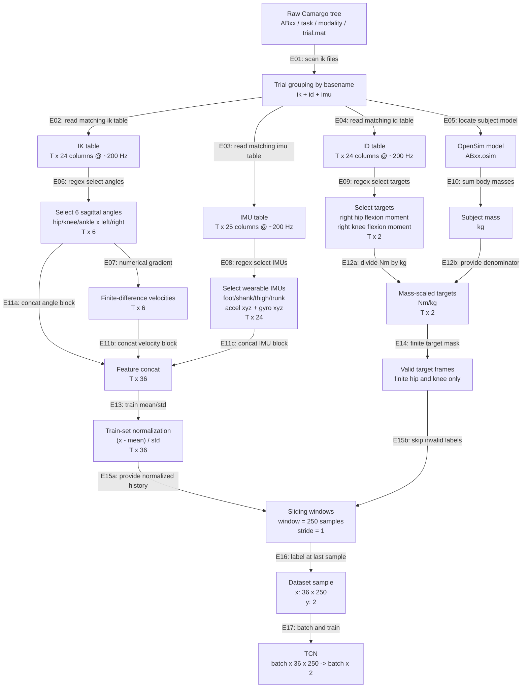

# Camargo Data Pipeline And Tensor Dimensions

This note documents the first working Camargo 2021 estimator pipeline. The
current implementation joins matching `ik`, `id`, and `imu` files by trial
basename, then trains a causal TCN to estimate right hip/knee biological joint
moments.

## Pipeline Figure



## Reading The Figure

先从 E01 开始看。这里不是随便取一个 `.mat`，而是先扫描所有 `ik/*.mat` 文件，把每个 IK 文件当成一个 trial 的入口。比如找到一个 `levelground_cw_fast_01_01.mat`，它就会用这个 basename 去同一个任务文件夹下面找对应的 `id/levelground_cw_fast_01_01.mat` 和 `imu/levelground_cw_fast_01_01.mat`。所以 E01 做完以后，其实就是把同一个 trial 的 `ik + id + imu` 三个模态配成一组。然后这组数据分三条线走。

第一条线是 IK。E02 先把 `ik` 文件读成一个 `T x 24` 的 table。这里的 `T` 是时间长度，24 是这个 table 里的列数，其中包括 `Header` 时间列，以及 pelvis、hip、knee、ankle 等 OpenSim 逆运动学坐标。E06 不是随便取 6 列，而是用列名 regex 从这个 `T x 24` 里挑出两条腿的髋、膝、踝矢状面角度，也就是 `hip_flexion_r/l`、`knee_angle_r/l`、`ankle_angle_r/l`，所以输出变成 `T x 6`。E07 接着对这 6 个角度沿时间方向做数值差分，也就是求导，用角度变化除以时间步长，得到对应的 6 个角速度，所以又得到一个 `T x 6`。到这里，IK 这条线贡献了两块 feature：一块是关节角度 `T x 6`，一块是关节角速度 `T x 6`，合起来是 `T x 12`。

第二条线是 IMU。E03 先把同名的 `imu` 文件读成一个 `T x 25` 的 table。这个 25 里面第一列通常是 `Header` 时间列，剩下 24 列是 4 个 IMU 的数据：foot、shank、thigh、trunk，每个 IMU 都有三轴加速度和三轴陀螺仪，也就是 `Accel_X/Y/Z` 和 `Gyro_X/Y/Z`。E08 用的 regex 是 `Accel|Gyro`，意思是只要列名里带 `Accel` 或 `Gyro` 就选中，所以 `Header` 不会被选中，最后刚好选出 24 个 IMU 通道，shape 从 `T x 25` 变成 `T x 24`。

第三条线是 ID，也就是 inverse dynamics。E04 把同名的 `id` 文件读成一个 `T x 24` 的 table。这个里面有 OpenSim 算出来的力矩和力，比如 hip、knee、ankle 的 moment。E09 从里面只选当前模型要预测的两个目标：`hip_flexion_r_moment` 和 `knee_angle_r_moment`，所以输出是 `T x 2`。E05 和 E10 另外会从这个 subject 的 `ABxx.osim` 里把各个 body segment 的 mass 加起来，得到这个人的体重。E12 就用这个体重把 ID 里的力矩从 `Nm` 除成 `Nm/kg`，所以最终 target 还是 `T x 2`，但单位变成了 `Nm/kg`。

这里最容易误会的是 E11a、E11b、E11c。图里现在写的是 concat，意思是按列拼接，也就是 `np.concatenate(..., axis=1)`，不是每条线各自变成一个 `T x 36`，也不是把三个东西塞进一个 tuple。IK 角度是 `T x 6`，IK 角速度是 `T x 6`，IMU 是 `T x 24`，这三块横向拼起来就是 `T x (6 + 6 + 24)`，也就是最终的 `T x 36`。所以 F 这个节点表示的是一个真正的二维数值矩阵，不是 tuple。可以把它想成一个 Excel 表，每一行是同一个时间点，前 6 列是关节角度，中间 6 列是关节角速度，后面 24 列是 IMU。

后面 E13 是归一化。它只用训练集统计每个 feature channel 的 mean 和 std，然后把 `T x 36` 的输入做 `(x - mean) / std`。E14 是处理 target 里的无效帧，因为 Camargo 的 ID 结果里有些时刻 hip/knee moment 是 NaN，不能拿来训练，也不能填 0，所以这里会做一个 finite mask，只保留 hip 和 knee 两个 target 都有效的时间点。E15 开始做滑窗，窗口长度是 250 个 sample，数据统一到 200 Hz，所以一个窗口就是 1.25 秒，stride 是 1，也就是每次往后移动一个采样点。E16 会把一个窗口整理成模型真正吃的样子：`x` 是 `36 x 250`，表示 36 个通道、250 个历史时间点；`y` 是长度为 2 的向量，表示窗口最后一个时刻的右髋和右膝力矩。最后 E17 把很多窗口组成 batch，输入 TCN 的 shape 就是 `batch x 36 x 250`，模型输出 `batch x 2`，对应每个窗口预测一个 hip moment 和一个 knee moment。

## Arrow Logic

| Edge | Operation | Input | Output | Implementation |
|---|---|---:|---:|---|
| E01 | Discover dynamic trial files and skip `static` | Camargo subject folders | list of `*/ik/*.mat` paths | `discover_trials()` |
| E02 | Read MATLAB `table` object from matching IK file | `ik/trial.mat` | IK DataFrame, roughly `T x 24` | `read_matlab_table()` |
| E03 | Read MATLAB `table` object from matching IMU file | `imu/trial.mat` | IMU DataFrame, roughly `T x 25` | `_camargo_modality_path()` + `_try_read_dataframe()` |
| E04 | Read MATLAB `table` object from matching ID file | `id/trial.mat` | ID DataFrame, roughly `T x 24` | `_camargo_modality_path()` + `_try_read_dataframe()` |
| E05 | Find subject OpenSim model | subject folder | `osimxml/ABxx.osim` | `_find_camargo_mass()` |
| E06 | Select sagittal hip/knee/ankle angles for both legs | IK DataFrame | `T x 6` | `feature_patterns` |
| E07 | Compute angular velocities from selected IK angles | `T x 6` angles | `T x 6` velocities | `np.gradient(angle, 1 / sample_hz)` |
| E08 | Select four wearable IMUs | IMU DataFrame | `T x 24` | `Accel|Gyro` regex |
| E09 | Select biological moment targets | ID DataFrame | `T x 2` | `target_patterns` |
| E10 | Sum all OpenSim segment masses | `ABxx.osim` XML | scalar subject mass in kg | XML `<mass>` elements |
| E11a | Concat angle features along feature axis | `T x 6` | part of `T x 36` | `np.concatenate(axis=1)` |
| E11b | Concat velocity features along feature axis | `T x 6` | part of `T x 36` | `np.concatenate(axis=1)` |
| E11c | Concat IMU features along feature axis | `T x 24` | final `T x 36` | `np.concatenate(axis=1)` |
| E12a | Convert inverse-dynamics moments to Nm/kg | `T x 2` Nm | `T x 2` Nm/kg | `moment / subject_mass_kg` |
| E12b | Provide body-mass denominator | kg scalar | mass-scaling factor | `_find_camargo_mass()` |
| E13 | Normalize features using training split only | `T x 36` | normalized `T x 36` | `compute_stats()` then `(x - mean) / std` |
| E14 | Keep only frames with finite hip and knee targets | `T x 2` | valid target mask | `np.isfinite(y).all(axis=1)` |
| E15a | Slice normalized features into causal histories | normalized `T x 36` | candidate windows | `window.length=250`, `stride=1` |
| E15b | Reject windows whose last target is invalid | target mask | filtered windows | `CamargoWindowDataset._build_index()` |
| E16 | Create supervised sample | 250-frame history | `x: 36 x 250`, `y: 2` | label at window's last sample |
| E17 | Train causal TCN | `batch x 36 x 250` | `batch x 2` | `TCNMomentEstimator` |

## Raw Trial Tables

For one representative trial, the public Camargo files are stored by modality:

```text
task/
  ik/trial_name.mat
  id/trial_name.mat
  imu/trial_name.mat
  fp/trial_name.mat
  gon/trial_name.mat
```

The current estimator uses only `ik`, `id`, and `imu`:

| Source | Meaning | Representative Raw Shape | Used Columns |
|---|---:|---:|---:|
| `ik/*.mat` | OpenSim inverse kinematics | `T x 24` | 6 joint angles |
| derived from `ik` | finite-difference angular velocity | `T x 6` | 6 joint velocities |
| `imu/*.mat` | wearable inertial sensors | `T x 25` | 24 accel/gyro channels |
| `id/*.mat` | OpenSim inverse dynamics | `T x 24` | 2 right-leg moments |
| `ABxx.osim` | subject OpenSim model | XML | body mass scaling |

`Header` is the time column in the Camargo tables. It is used to estimate the
sample rate. The current files inspect at approximately 200 Hz for `ik`, `id`,
and `imu`.

## Example Trial

Example basename:

```text
AB06/10_09_18/levelground/*/levelground_cw_fast_01_01.mat
```

The loader joins:

```text
levelground/ik/levelground_cw_fast_01_01.mat
levelground/id/levelground_cw_fast_01_01.mat
levelground/imu/levelground_cw_fast_01_01.mat
```

For this example, the parsed raw tables are:

| Modality | Parsed Shape | Notes |
|---|---:|---|
| IK | `3223 x 24` | includes `Header` plus OpenSim coordinates |
| ID | `3223 x 24` | includes `Header` plus OpenSim moments/forces |
| IMU | `3223 x 25` | includes `Header` plus 24 IMU channels |
| joined features | `3223 x 36` | selected IK angles, derived velocities, IMUs |
| joined targets | `3223 x 2` | right hip/knee moment in Nm/kg |

Subject mass for this example is parsed from `AB06/osimxml/AB06.osim`:

```text
subject_mass = 78.09885 kg
```

Example selected IK angle values at the first frame:

| Channel | Value |
|---|---:|
| `ik.hip_flexion_r` | `-2.67696` |
| `ik.knee_angle_r` | `-26.32251` |
| `ik.ankle_angle_r` | `30.32350` |
| `ik.hip_flexion_l` | `18.35915` |
| `ik.knee_angle_l` | `-12.10357` |
| `ik.ankle_angle_l` | `-8.54311` |

Example unscaled ID values at the first frame:

| Channel | Nm |
|---|---:|
| `id.hip_flexion_r_moment` | `-12.87424` |
| `id.knee_angle_r_moment` | `-8.30160` |

After body-mass scaling:

| Channel | Nm/kg |
|---|---:|
| `id.hip_flexion_r_moment` | `-0.16485` |
| `id.knee_angle_r_moment` | `-0.10630` |

Not every ID row is valid. In this example, about 62.4% of frames have finite
right hip and knee moment targets. Invalid target frames are skipped when
building windows rather than filled with zero.

## Feature Tensor

After joining one trial:

```text
x_trial: T x 36
y_trial: T x 2
```

The 36 input channels are:

| Block | Channels | Shape |
|---|---:|---:|
| sagittal IK angles | 6 | `T x 6` |
| sagittal IK angular velocities | 6 | `T x 6` |
| foot IMU accel + gyro | 6 | `T x 6` |
| shank IMU accel + gyro | 6 | `T x 6` |
| thigh IMU accel + gyro | 6 | `T x 6` |
| trunk IMU accel + gyro | 6 | `T x 6` |
| total | 36 | `T x 36` |

The two target channels are:

| Target | Unit | Shape |
|---|---:|---:|
| right hip flexion moment | Nm/kg | `T x 1` |
| right knee flexion moment | Nm/kg | `T x 1` |
| total | Nm/kg | `T x 2` |

## Windowed Training Samples

The TCN consumes fixed-length causal windows:

```text
sample rate = 200 Hz
window length = 250 samples = 1.25 s
stride = 1 sample = 0.005 s
```

Each dataset item has:

```text
x_window: 36 x 250
y_target: 2
```

For batching:

```text
batch x 36 x 250 -> TCN -> batch x 2
```

The target is the hip/knee moment at the last sample of the window. Windows
whose target frame has missing inverse-dynamics moments are skipped instead of
being filled with zero.

For the example trial above:

```text
x_trial: 3223 x 36
y_trial: 3223 x 2
```

With `window.length=250` and `stride=1`, the maximum number of candidate
windows before target masking is:

```text
3223 - 250 + 1 = 2974 windows
```

After masking invalid final-frame targets, only windows whose last frame has
both finite right hip and right knee moments are kept.

## Current Five-Subject Cache

With AB06-AB10 extracted and `window.length=250`, the current smoke check
produced:

```text
train windows: 1,972,904
val windows:     444,393
x shape:         (36, 250)
y shape:         (2,)
```

The current split held out one participant:

```text
train subjects: AB06, AB07, AB08, AB09
val subject:    AB10
```

## FAQ And Background Knowledge

**Q: 这个数据不是人体采集的吗，为什么会有 OpenSim？** 这两件事不矛盾。Camargo 的原始实验确实是人体采集数据，比如 motion capture marker、IMU、force plate、treadmill force、EMG、goniometer 等；但是 hip/knee biological joint moment 这种量不是传感器能直接测到的，人体膝关节里没有一个传感器直接告诉我们净关节力矩是多少。OpenSim 在这里不是用来编假数据，而是用来把真实采集到的运动和外力转换成 biomechanical variables。简单说，第一层是真实采集的 marker/IMU/force 数据，第二层是 OpenSim 后处理得到的 IK 关节角度和 ID 关节力矩，第三层才是我们用这些处理结果训练深度模型。

**Q: OpenSim 在这个 pipeline 里具体做了什么？** OpenSim 需要一个 subject-specific 或 scaled musculoskeletal model，也就是 `ABxx.osim`。这个模型里定义了 pelvis、femur、tibia、foot、torso 等 body segment，以及每个 segment 的 mass、inertia、joint 坐标系和自由度。Camargo 公开数据里已经包含了 OpenSim 处理后的 `ik`、`id`、`jp` 等文件；我们不是重新跑 OpenSim，而是读取他们已经算好的 IK 和 ID 结果。当前代码还会从 `ABxx.osim` 里把所有 `<mass>` 加起来，得到 subject body mass，用来把力矩从 `Nm` 缩放成 `Nm/kg`。

**Q: IK 是什么？** IK 的全称是 inverse kinematics，中文一般叫逆运动学。它回答的问题是：如果我已经知道人体 marker、骨段姿态或者关节中心的大致运动轨迹，那么 OpenSim 这个骨骼模型里的各个关节角度应该是多少，才能最好地解释这些观测到的运动？所以 IK 的输出主要是运动学量，比如 `hip_flexion_r`、`knee_angle_r`、`ankle_angle_r` 这种关节角度。它不直接告诉我们关节用了多大力，只告诉我们身体“怎么动”。

**Q: ID 是什么？** ID 的全称是 inverse dynamics，中文一般叫逆动力学。它回答的问题比 IK 更进一步：如果我知道人体是怎么动的，也知道地面对脚的外力，比如 force plate 或 treadmill force，那么要产生这个运动，各个关节需要多大的净力矩？所以 ID 的输出是动力学量，比如 `hip_flexion_r_moment` 和 `knee_angle_r_moment`。我们现在训练模型的 ground truth 就来自 ID，因为 biological joint moment 本质上就是 OpenSim 逆动力学估计出来的关节净力矩。

**Q: 为什么训练时可以用 OpenSim/force plate，但部署时又说是 wearable estimator？** 因为 OpenSim ID 和 force plate 主要是训练 label 的来源，不一定是最终实时输入的一部分。训练阶段可以用实验室设备和 OpenSim 算出比较可信的 joint moment ground truth；部署阶段，比如外骨骼实时控制，不可能随身带 force plate，所以模型要学习的是用 wearable-like inputs 去估计这些 OpenSim ID moments。当前第一版输入用了 IK + IMU，其中 IMU 是真正的 wearable signal，IK 在后续部署时可以替换成来自外骨骼编码器、人体状态估计器或仿真状态的关节角/角速度。

**Q: IMU 是什么？** IMU 是 inertial measurement unit，也就是惯性测量单元。它通常包含 accelerometer 和 gyroscope，有时还包含 magnetometer。Camargo 这里用到的是 foot、shank、thigh、trunk 四个 IMU，每个 IMU 有 3 轴加速度和 3 轴角速度，所以每个 IMU 是 6 个通道，四个 IMU 一共 24 个通道。IMU 是 wearable sensor，所以它很适合后续外骨骼实时估计场景。

**Q: Accel 是什么？** Accel 是 accelerometer 的缩写，也就是加速度计。`Accel_X/Y/Z` 表示某个 IMU 在自身坐标系或处理后坐标系下沿 x、y、z 三个方向测到的线加速度。它能反映身体段的平移运动、冲击、摆动和重力方向变化。比如 foot IMU 的 accel 在 heel strike 附近通常会有明显变化，thigh/shank 的 accel 会随着 swing 和 stance 变化。

**Q: Gyro 是什么？** Gyro 是 gyroscope 的缩写，也就是陀螺仪。`Gyro_X/Y/Z` 表示某个 IMU 绕 x、y、z 三个轴的角速度。它更直接反映身体段在旋转，比如小腿摆动、足部翻转、大腿前后摆动等。对步态来说，gyro 通常对 gait phase 很有信息量，因为腿段旋转模式和步态周期强相关。

**Q: Joint angle 和 angular velocity 分别是什么？** Joint angle 是关节角度，比如髋屈伸角、膝屈伸角、踝背屈/跖屈角。Angular velocity 是关节角速度，也就是角度随时间的变化率。Camargo 的 IK 文件里有角度，但当前 pipeline 里会额外用 `np.gradient(angle, dt)` 从角度计算角速度。直觉上，角度告诉模型“现在关节在哪里”，角速度告诉模型“关节正在往哪个方向、多快地动”。

**Q: Joint moment 是什么？** Joint moment 是关节力矩，单位通常是 `Nm`。它可以理解成关节周围肌肉、被动组织和外力共同作用后，在某个关节自由度上表现出来的净转动力矩。比如 `hip_flexion_r_moment` 是右髋屈伸方向的净力矩，`knee_angle_r_moment` 是右膝屈伸方向的净力矩。我们把它除以 body mass 后得到 `Nm/kg`，这样不同体重 subject 之间更可比。

**Q: Nm/kg 是什么，为什么不用 Nm？** `Nm` 是力矩单位，体重大的人通常绝对力矩也更大。为了让不同 subject 的力矩尺度更可比，生物力学里常把关节力矩除以体重，得到 `Nm/kg`。这样模型更容易学习跨 subject 的规律，也更接近 Molinaro et al. 这类 joint moment estimation 论文里的报告方式。

**Q: TCN 是什么？** TCN 是 Temporal Convolutional Network，也就是时间卷积网络。它不是只看一个时间点，而是看一段历史窗口。当前每个输入窗口是 `36 x 250`，代表 36 个通道、250 个历史 sample。在 200 Hz 下，250 个 sample 就是 1.25 秒。TCN 用 causal dilated convolution 从这段历史里提取步态时序特征，然后输出窗口最后一帧的 hip/knee moment。
